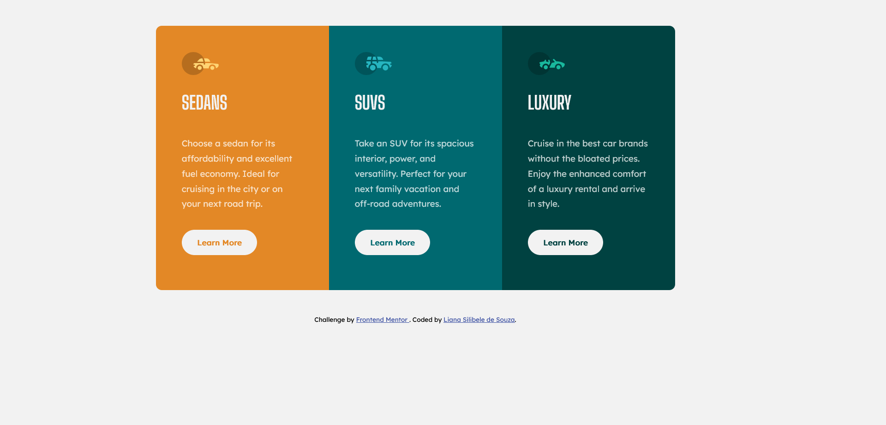
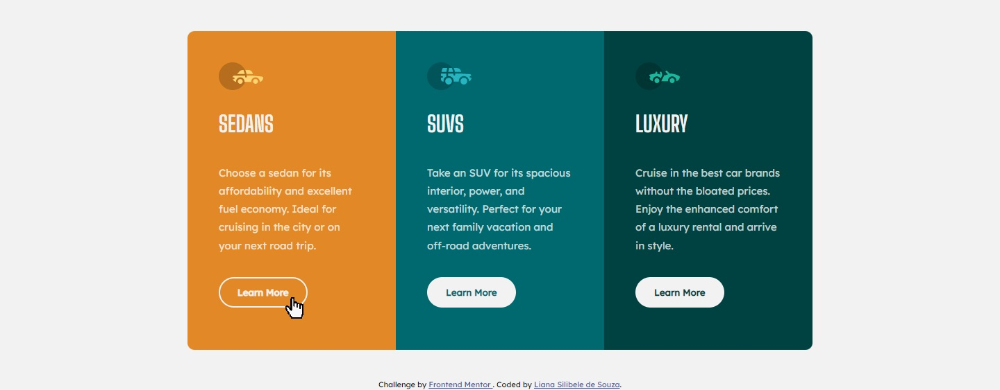

# Frontend Mentor - 3-column preview card component solution

Essa é uma solução para o desafio [3-column preview card component challenge on Frontend Mentor](https://www.frontendmentor.io/challenges/3column-preview-card-component-pH92eAR2-).

## Índice

- [Visão Geral](#overview)
- [O Desafio](#the-challenge)
- [Captura de tela](#screenshot)
- [Construído com](#built-with)
- [O que aprendi](#what-i-learned)
- [Desenvolvimento contínuo](#continued-development)
- [Autora](#author)
- [Agradecimentos](#acknowledgments)

## Visão Geral

Este é um desafio do Frontend Mentor para praticar o desenvolvimento web usando as tecnologias HTML e CSS.

### O Desafio

O desafio consiste em construir um componenente "card" de três colunas, fazendo-o o mais parecido possível com o design proposto pelo Frontend Mentor.
Os Usuários devem ser capazes de:

- Ver o layout ideal, dependendo do tamanho da tela do dispositivo
- Ver os elementos interativos

### Capturas de tela

### Construído com

- HTML
- CSS
- Flexbox
- Mobile-first
- Media query

### O que aprendi

Este projeto serviu para trabalhar mais sobre o posicionamento de elementos no CSS. Além de aprender o mínimo sobre como fazer páginas responsivas.

### Desenvolvimento contínuo

Vejo que preciso melhorar a semântica no meu HTML, utilizando os elementos corretos, assim como a criação e nomeação de classes, a fim de facitlitar o trabalho quando for estilizar o CSS.

## Autora

- LinkedIn - [@lianasilibele](https://www.linkedin.com/in/lianasilibele/)
- GitHub - [@lianasilibele](https://github.com/lianasilibele)
- Frontend Mentor - [@lianasilibele](https://www.frontendmentor.io/profile/lianasilibele)

## Agradecimentos

Gostaria de agradecer ao Natanael de Paulo [@Natanael-de-Paulo](https://github.com/Natanael-de-Paulo), que me ajudou a dar o "start" no CSS desse projeto, me dando dicas sobre Flexbox e posicionamento em geral, e ao Giuseppe Varriale [@GiuseppeVarriale](https://github.com/GiuseppeVarriale) por ter me explicado e ajudado como media query.
